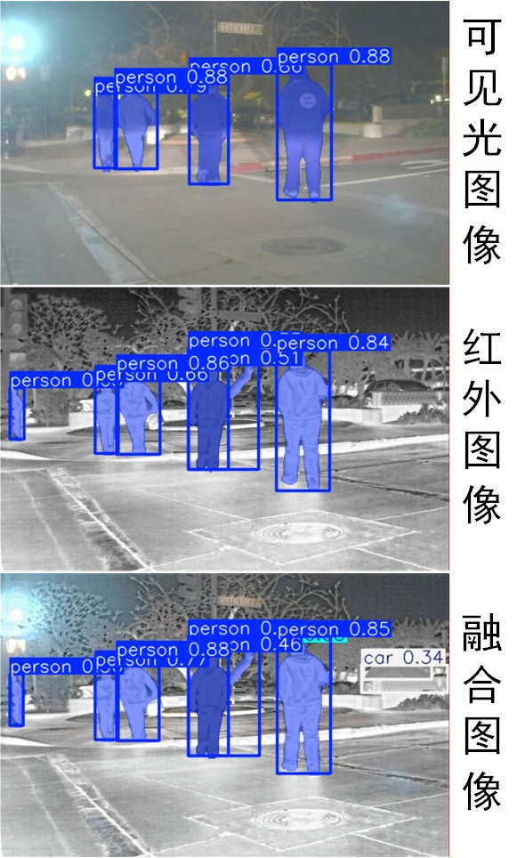

# MTHS-LMPFusion
A Unified Hybridly Supervised Framework for Multi-Task Image–Spectral Fusion with Large-Model Prior Enhancement

Code will be released after publication.

<p align="center">
  
</p>


# Environment & Requirements

This project has been tested and verified under the following **hardware and software environment**.  
For reproducibility and stable execution, it is **strongly recommended** to use a compatible setup.

---

## Operating System

- **OS**: Ubuntu 20.04 LTS  
- **Kernel**: Linux x86_64  
- **Shell**: bash  

Verification:
```bash
lsb_release -a
```

---

## GPU Hardware

- **GPU Model**: NVIDIA GeForce RTX 2080 Ti  
- **Architecture**: Turing (TU102)  
- **GPU Memory**: 11 GB  

Verification:
```bash
nvidia-smi
```

---

## NVIDIA Driver

- **Driver Version**: **535.230.02**  
- **Installation Method**: Ubuntu official `apt` repository  
- **Driver Type**: Proprietary (non-open)

Verification:
```bash
nvidia-smi
```

> **Note**  
> The NVIDIA driver is installed and managed via `apt`, not via CUDA runfile.  
> This ensures system stability, compatibility with the desktop environment, and easy rollback.

---

## CUDA Toolkit (nvcc)

- **CUDA Toolkit Version**: **11.8**  
- **Installation Path**: `/usr/local/cuda-11.8`  
- **nvcc Version**: `release 11.8`

Verification:
```bash
nvcc -V
```

Recommended environment variables:
```bash
export CUDA_HOME=/usr/local/cuda-11.8
export PATH=$CUDA_HOME/bin:$PATH
export LD_LIBRARY_PATH=$CUDA_HOME/lib64:$LD_LIBRARY_PATH
```

> **Important**  
> CUDA Toolkit is installed **without installing the CUDA driver**, since the system already provides  
> a compatible NVIDIA driver (Driver ≥ 520 is required for CUDA 11.8).

---

## Python Environment

- **Python Version**: 3.8 / 3.9  
- **Environment Manager**: conda  

Example:
```bash
conda activate <your_env_name>
python --version
```

---

## PyTorch

- **PyTorch Version**: **2.0.1**  
- **CUDA Runtime**: **cu117** (bundled with PyTorch)  
- **Installation Source**: Official PyTorch wheels

Verification:
```bash
python - << 'PY'
import torch
print("Torch version:", torch.__version__)
print("CUDA runtime:", torch.version.cuda)
print("CUDA available:", torch.cuda.is_available())
PY
```

> **Note**  
> PyTorch CUDA runtime is **independent** of the system CUDA Toolkit.  
> The CUDA Toolkit (`nvcc`) is required only for compiling custom CUDA extensions.

---

## Mamba-SSM and CUDA Extensions

- **mamba-ssm**: installed from PyPI (source build with CUDA support)  
- **causal-conv1d**: installed from PyPI (custom CUDA extension)

Installation:
```bash
pip install --no-build-isolation --no-cache-dir mamba-ssm causal-conv1d
```

Requirements:
- `nvcc >= 11.6`
- NVIDIA Driver ≥ 520

Verification:
```bash
python - << 'PY'
from mamba_ssm.ops.selective_scan_interface import selective_scan_fn
print("mamba-ssm CUDA ops available")
PY
```

---

## Environment Summary

| Component            | Version / Model                     |
|---------------------|-------------------------------------|
| OS                  | Ubuntu 20.04 LTS                    |
| GPU                 | NVIDIA GeForce RTX 2080 Ti           |
| NVIDIA Driver       | 535.230.02                          |
| CUDA Toolkit (nvcc) | 11.8                                |
| PyTorch             | 2.0.1 + cu117                       |
| mamba-ssm           | PyPI (CUDA-enabled build)           |
| Python              | 3.8 / 3.9                           |

---

## Reproducibility Notes

- NVIDIA Driver, CUDA Toolkit, and PyTorch CUDA runtime are **decoupled by design**.
- When upgrading **PyTorch** or **mamba-ssm**, ensure:
  - NVIDIA driver compatibility
  - CUDA Toolkit (`nvcc`) satisfies CUDA extension build requirements
- For long-term reproducibility, exporting the environment is recommended:
```bash
conda env export > environment.yml
```

---

If you encounter environment-related issues, please verify the versions listed above  
before reporting bugs or opening issues.
